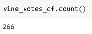
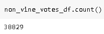
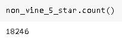
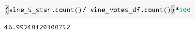
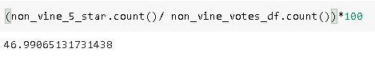

# Amazon Vine Analysis
## Overview

This analysis looks at whether bias is created from the Amazon Vine Program.  The Amazon Vine Program lets companies pay Amazon a small fee and in return Amazon Vine Program members receive that company's product and are required to write a review of the product.  This analysis looks at whether the program biases reviews to be more positive vs. non program revies.

## Results

### How many Vine reviews and non-Vine reviews were there?

There were 266 vine reviews and 38,829 non-Vine reviews

 

### How many Vine reviews were 5 stars? How many non-Vine reviews were 5 stars?

There were 125 Vine 5 star reviews and 18,246 non-Vine 5 star reviews.

 

### What percentage of Vine reviews were 5 stars? What percentage of non-Vine reviews were 5 stars?

There was 46.99248% of Vine reviews that were 5 star and 46.99065% of non-Vine reviews that were 5 star. 

 

## Summary
There was less than .01% difference between the percent of 5 star reviews that were part of the Vine Program versus those that were not.  Based off of this results, it does not appear that the Vine Program causes a bias toward positive reviews.  Analyzing more datasets would be beneficial to provide additional support for or against this conclusion. 